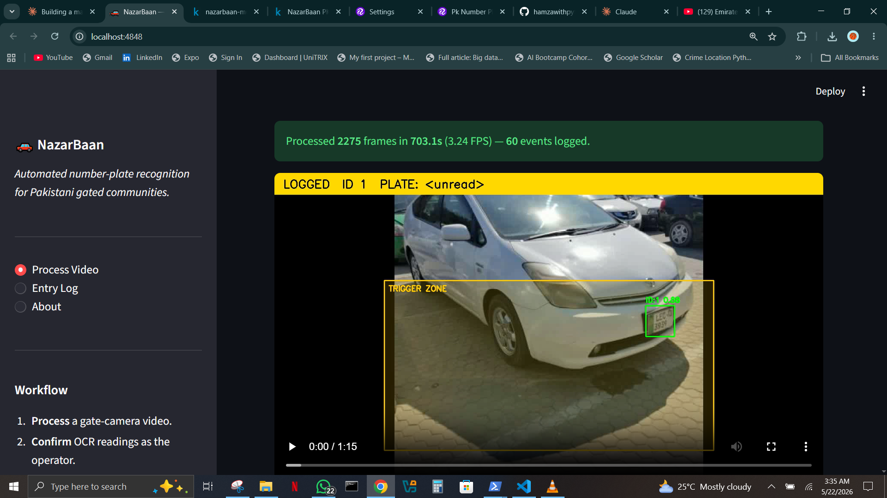
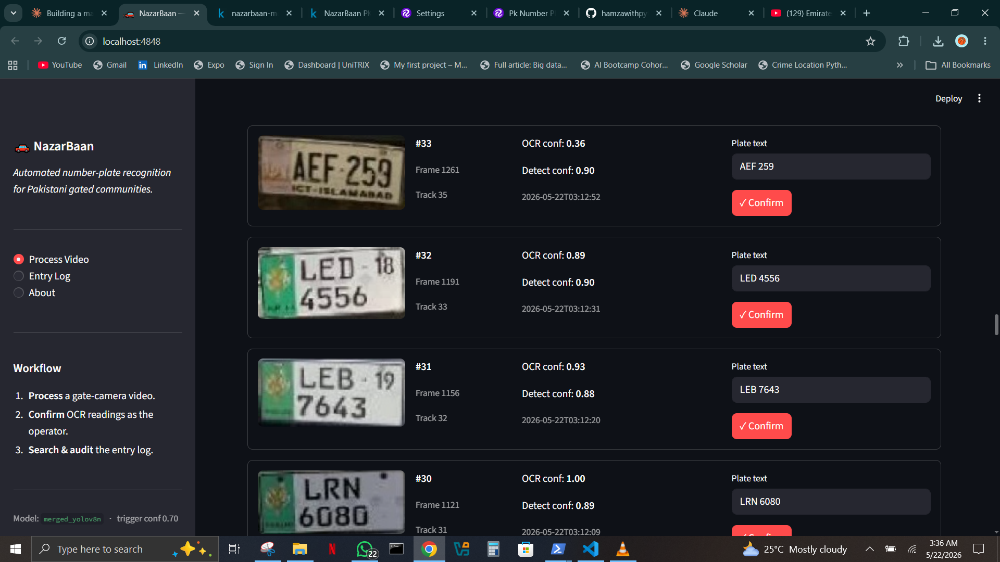
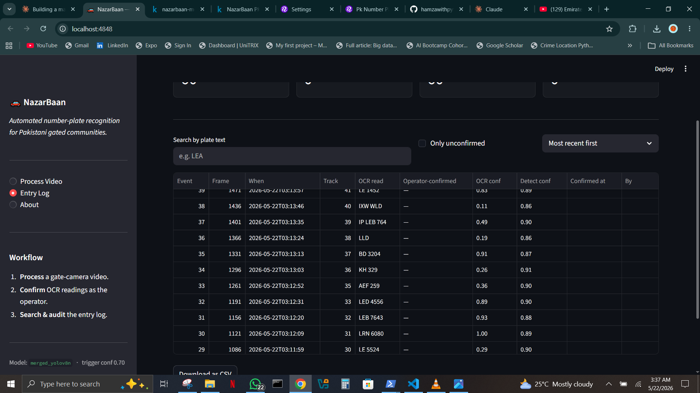

# NazarBaan — Pakistani ANPR for Gated Communities

> *Nazarbaan (نظربان) — Urdu for "watchman, one who keeps watch."*

An end-to-end automated number-plate recognition (ANPR) system for Pakistani housing societies. Replaces pen-and-register gate logs with a real-time computer-vision pipeline that detects plates, reads them, logs entries with timestamps, and surfaces them to a gate operator for confirmation — producing a searchable, tamper-evident audit trail of every vehicle.



---

## What it does

| | |
|---|---|
| 🎯 **Detects** plates in any frame | Fine-tuned YOLOv8n, 0.992 mAP@0.5 on held-out test set |
| 🔍 **Reads** the plate text | EasyOCR + Pakistani-plate-aware post-processing (44% exact match) |
| 🆔 **Tracks** the same car across frames | Ultralytics ByteTrack, no duplicate logs |
| 🚦 **Logs once at the gate** | Trigger-zone state machine; OCR fires exactly once per vehicle |
| 👤 **Operator-in-the-loop** | Operator confirms or corrects each OCR reading before the gate opens |
| 📒 **Audit trail by design** | Original OCR readings preserved alongside operator corrections in SQLite |
| 📈 **Improves over time** | Each correction becomes labeled training data for OCR fine-tuning |

---

## See it in action

🎬 **Watch the 2-minute demo:** [`reports/demo/nazarbaan_demo.mp4`](reports/demo/nazarbaan_demo.mp4)

Or scrub through these stills:

<table>
  <tr>
    <td></td>
    <td></td>
  </tr>
  <tr>
    <td align="center"><b>Operator confirmation</b><br/>Plate crop + OCR guess + edit/confirm.</td>
    <td align="center"><b>Entry log with audit trail</b><br/>Machine reading vs. human approval, side by side.</td>
  </tr>
</table>

---

## Headline numbers

| Metric | Value |
|---|---:|
| Detector test mAP@0.5 | **0.992** |
| Detector precision at conf=0.70 | **1.000** |
| OCR exact-match (production pipeline) | **44%** |
| End-to-end CPU inference | **3.15 FPS** |
| Lift from data augmentation (val recall) | **+10.7 pp** |
| Lift from OCR engineering (exact match) | **+28 pp** |

📄 **Read the full report:** [`docs/final_report.md`](docs/final_report.md)
🛠 **Deployment hardware guide:** [`docs/deployment_guide.md`](docs/deployment_guide.md)

---

## Project phases

| Phase | Status | Notebook / Code |
|---|:---:|---|
| 1. Project setup | ✅ | — |
| 2. Data acquisition & EDA | ✅ | [`01_eda_burhan_khan.ipynb`](notebooks/01_eda_burhan_khan.ipynb), [`03_eda_ubaidp1049.ipynb`](notebooks/03_eda_ubaidp1049.ipynb) |
| 3. Baseline YOLOv8n training | ✅ | [`02_kaggle_baseline_training.ipynb`](notebooks/02_kaggle_baseline_training.ipynb) |
| 4. Dataset merge & retrain | ✅ | [`04_kaggle_merged_training.ipynb`](notebooks/04_kaggle_merged_training.ipynb), [`05_baseline_vs_merged_comparison.ipynb`](notebooks/05_baseline_vs_merged_comparison.ipynb) |
| 5. Held-out evaluation | ✅ | [`06_model_evaluation.ipynb`](notebooks/06_model_evaluation.ipynb) |
| 6. OCR benchmark & engineering | ✅ | [`08_ocr_benchmark.ipynb`](notebooks/08_ocr_benchmark.ipynb) |
| 7. End-to-end pipeline | ✅ | [`src/pipeline/`](src/pipeline/) |
| 8. Streamlit gate app | ✅ | [`src/app/`](src/app/) |
| 9. Final report & demo | ✅ | This page + [`docs/final_report.md`](docs/final_report.md) |

---

## How it works
Video frame
│
▼
┌────────────────┐
│ YOLOv8n        │  detects every plate in the frame
│ + ByteTrack    │  assigns persistent track_id per vehicle
└────────┬───────┘
│
▼
┌────────────────┐
│ Trigger zone   │  is this plate at the gate right now?
│ state machine  │  yes  →  is this track_id already logged?
└────────┬───────┘  yes  →  skip
│          no   →  log it, fire OCR once
▼
┌────────────────┐
│ PlateReader    │  EasyOCR raw + EasyOCR preprocessed
│ (production)   │  + Pakistani-plate cleanup + best-of-two
└────────┬───────┘
│
▼
┌────────────────┐
│ SQLite store   │  events (immutable) + corrections (operator)
│ + Streamlit UI │  audit trail preserved by design
└────────────────┘

---

## Repository structure

nazarbaan/
├── data/              # Raw, processed, merged datasets (gitignored except .gitkeep)
├── notebooks/         # EDA, training, evaluation, OCR benchmark
├── src/
│   ├── ocr/           # PlateReader — production OCR module
│   ├── pipeline/      # PlateTracker + GateEventLogger
│   └── app/           # Streamlit dashboard + SQLite store
├── models/            # Trained weights (gitignored; see GitHub Releases)
├── scripts/           # Dataset download, crop extraction, video synthesis, runner
├── configs/           # Reserved for future config files
├── reports/
│   ├── figures/       # 28 generated figures for the report
│   ├── screenshots/   # App screenshots
│   ├── demo/          # 2-minute walkthrough video
│   └── *.csv, *.yaml, *.json — training metrics & configs
├── docs/              # Final report, deployment guide, model docs
├── tests/             # Reserved for future tests
└── .streamlit/        # App config (pinned port 4848 to dodge Hyper-V reservations)

---

## Run it yourself

### Prerequisites

- Python 3.10–3.12 (tested on 3.12.6)
- ~3 GB free disk for models + dependencies
- Windows / Linux / macOS — works anywhere PyTorch CPU runs

### Setup

```bash
git clone https://github.com/hamzawithpython/NazarBaan.git
cd NazarBaan

# Create + activate a virtual environment
python -m venv .venv
.venv\Scripts\Activate.ps1     # Windows
# source .venv/bin/activate    # Linux/macOS

pip install -r requirements.txt
```

### Get the trained weights

The 6.3 MB `best.pt` weight file is attached to the **v0.1 GitHub Release**, not the repo (keeps the repo lean). Download `merged_yolov8n_artifacts.zip` from the release page, unzip into `models/merged_yolov8n/`. The directory layout should look like:

models/merged_yolov8n/train/weights/best.pt

### Launch the app

```bash
streamlit run src/app/streamlit_app.py
```

Opens at `http://localhost:4848`. Upload a video on the **Process Video** tab and click ▶ Run pipeline.

### Re-train from scratch (optional)

The training notebooks (`02_kaggle_baseline_training.ipynb`, `04_kaggle_merged_training.ipynb`) target Kaggle's free T4 GPU. The datasets are mirrored on Kaggle (`hamzaasifff/nazarbaan-pk-plates-v1`, `hamzaasifff/nazarbaan-pk-plates-merged-v1`) so any Kaggle user can re-run them and reproduce the metrics within sampling noise.

---

## Tech stack

| Layer | Choice | Why |
|---|---|---|
| Detection | Ultralytics YOLOv8n | Mature tooling, built-in ByteTrack, fast on CPU |
| OCR | EasyOCR + custom post-processing | PaddleOCR broken on Windows CPU; TrOCR hallucinates English; EasyOCR's CRNN errors are recoverable |
| Tracking | Ultralytics ByteTrack | Bundled with YOLOv8, no extra config |
| App | Streamlit + SQLite | Right tool for a single-operator gate UI |
| Training compute | Kaggle T4 GPU | 30 free hours/week; reliable; reproducible |

---

## Honest limitations

1. **OCR at 44% exact match is not deployable as an unsupervised system.** The product is designed around operator confirmation, which is how every commercial ANPR system in production handles the same limitation.
2. **The OCR benchmark used n=25 hand-labeled crops** — the 44% figure has a ~10-percentage-point confidence interval.
3. **The pipeline was validated on a synthesized video** (test images stitched together), which exercises the architecture but does not fully validate ByteTrack's frame-to-frame deduplication. Real gate footage will.
4. **Severe blur and oblique angles remain unsolved.** Camera placement is the mitigation, not more model engineering. See [`docs/deployment_guide.md`](docs/deployment_guide.md).

📄 The full report's §10 ("Challenges and What I Learned") names every methodological issue caught during development, including a metric-reporting bug I corrected before publication.

---

## Author

**Hamza Asif** — Computer Vision Portfolio Project (Cohort 16).

- 🐙 GitHub: [@hamzawithpython](https://github.com/hamzawithpython)
- 🚀 Repo: [github.com/hamzawithpython/NazarBaan](https://github.com/hamzawithpython/NazarBaan)

---

## License & attribution

Source code: MIT. Datasets retain their original licenses:

- Burhan Khan — Pk Number Plates v1 (Roboflow Universe): **CC BY 4.0**
- ubaidp1049 — Pakistani Vehicle Number Plate ANPR YOLO (Kaggle): **CC0-1.0**

---

*Built end-to-end across 9 phases of empirical, version-controlled engineering. See the commit history for the full work.*